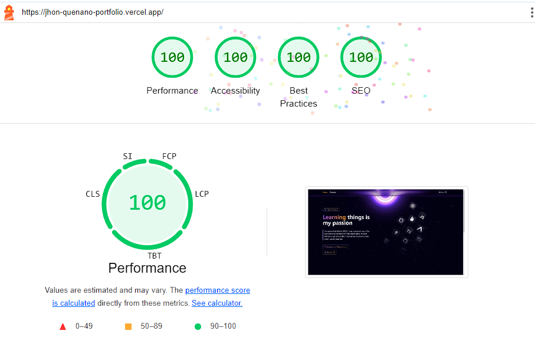

# Portfolio - Manage landing page solution

- 0 Library installed. The more library that are installed, the more the initial load time of this webpage
- Video and Particles animations are loaded lazily, prioritizing the content first. This ensures that the content is show first, which is beneficial for users with slower internet speed
- All icons used in this portfolio are manually defined. The default icons provided by Next.js [lucide-react] have been uninstalled to maintain a lightweight bundle
- All images used in this portfolio are compressed into WebP and WebM formats to further reduce the bundle size
- Projects page is separated to avoid too much rendering during the initial load on the Home Page
- Next.js I used this to optimize the initial load time and provide the first layer of SEO for this portfolio
- Schema.org I used this for second layer of SEO by embedding MicroData within the JSX. This helps search engine crawlers better understand the content. You can learn more about Schema.org by reading their guide
  - https://schema.org/docs/gs.html

## Built with

- Next.js
- TypeScript
- TailwindCSS

## Author

- Created by - Jhon Queñano
